# AutoSegmentor

[](https://github.com/thippeswammy/AutoSegmentor)
[](https://drive.google.com/file/d/1Y19lwf_IIuzwVe-3j9vX0uicV_iWbrHZ/view?usp=sharing)


_AutoSegmentor is a state-of-the-art auto-labeling ecosystem that bridges the gap between raw video footage and structured AI datasets. By integrating Meta AI's **Segment Anything Model 2 (SAM2)** with high-precision tracking like **CoTracker**, it enables users to generate pixel-perfect masks and pose estimation data for long, complex videos with minimal manual interaction._

**Main purpose:**  
Build an end-to-end auto-labeling pipeline that converts raw videos into structured YOLO-compatible datasets using SAM2, with real-time segmentation enabled by CUDA acceleration, multithreading, and an interactive PyQt5 GUI.

---

## ✨ Features

- **Professional Desktop UI**: A fully-featured PyQt5 application with multi-window support, integrated property panels, and real-time visualization.
- **Automated Frame Extraction**: Robust extraction from any video format, handling long-form content with ease.
- **Interactive Annotation**: Point and box-based multi-class annotation with a high-fidelity zoom system for precision.
- **Advanced Tracking (CoTracker)**: Integrated CoTracker support for tracking keypoints across frames with high accuracy—a robust alternative to Optical Flow for complex scenes.
- **Real-time Mask Propagation**: Propagate annotations across batches of frames using SAM2's temporal memory.
- **Async Processing Engine**: Background execution of GPU tasks ensures the UI remains responsive even during heavy inference.
- **YOLO Dataset Creation**: Seamless conversion of verified masks into YOLOv8/v11 formats with integrated data augmentation (blur, noise, color jitter).
- **Comprehensive Workspace Management**: Smart handling of project lifecycles, from raw input to verified output, with automatic directory cleanup.

---

## 🔧 Setup & Installation

### Prerequisites
- **Python**: 3.10+
- **GPU**: NVIDIA GPU with CUDA (Required for SAM2/CoTracker performance).
- **RAM**: 16GB+ recommended.

### Installation Steps

1.  **Clone the Repository**
    ```bash
    git clone --recursive https://github.com/thippeswammy/AutoSegmentor.git
    cd AutoSegmentor
    ```

2.  **Environment Setup**
    ```bash
    python -m venv .venv
    # Windows
    .\.venv\Scripts\activate
    # Linux
    source .venv/bin/activate
    ```

3.  **Install Dependencies**
    ```bash
    pip install -r requriments_i_used.txt
    ```

    # Ensure submodules are initialized
    git submodule update --init --recursive
    ```

5.  **Download Model Checkpoints**
    - Place `sam2_hiera_large.pt` in `external/segment_anything_2/checkpoints/`.
    - Place `scaled_offline.pth` in `external/co-tracker/checkpoints/`.

---

## 🚀 Usage Guide

### 1. Preparing Workspace
- Place your videos in `workspace/VideoInputs/`.
- Ensure your configuration is set in `workspace/inputs/config/default_config.yaml`.

### 2. Launching the Application

Start the standard interactive GUI for annotation and project management:

```bash
python run_main.py
```

To run the **Automated Demo Pipeline** on sample video data:

```bash
python run_main.py --demo
```

### 3. Annotation Controls (Keyboard & Mouse)

| Action | Control |
| :--- | :--- |
| **Foreground Point** | Left Click |
| **Background Point** | Right Click |
| **Undo Action** | `Ctrl + Z` or `U` |
| **Redo Action** | `Ctrl + Y` |
| **Navigate Frames** | `A` / `D` or `Left` / `Right` |
| **Turbo Scroll** | `Shift + A` / `Shift + D` |
| **Batch Navigation** | `[` / `]` |
| **Change Class (1-10)** | Keys `1` to `0` |
| **Instance Management** | `Tab` (Next) / `Shift + Tab` (Prev) |
| **Toggle Mask Overlay** | `M` |
| **Toggle Corner Zoom** | `Z` |
| **Reset Frame** | `R` |
| **Process Batch** | `Enter` / `Return` |
| **Save Progress** | `Ctrl + S` |
| **Export Dataset** | `Ctrl + E` |

---

## 🏗️ System Architecture

AutoSegmentor is designed as a reactive, UI-driven desktop application. It transitions from a linear script-based pipeline to a modular, package-based architecture that separates the graphical interface from heavy machine learning computations.

### Master System Architecture

```mermaid
flowchart TD
    %% =========================================================
    %% Swimlanes (vertical pipeline)
    %% =========================================================

    subgraph "User / HITL (Human-in-the-loop)"
        U["User / Annotator"]:::external
        UI["PyQt5 MainWindow / UI\n(MainWindow.py)\npoints, zoom, sidepanel"]:::ui
        AM["AnnotationManager\nsave/load prompts, keypoints"]:::ui
        LOG["Logging\n(logger_config.py)"]:::ui
        JP[("User Prompts JSON\npoints_labels_*.json")]:::store
    end

    subgraph "Orchestration / Control Plane"
        DRIVER["Main Entry\nrun_demo.py"]:::orch
        SETUP["Setup Dialog\n(SetupDialog.py)"]:::ui
        PIPE["Pipeline Orchestrator\n(pipeline.py)\ncoordinates extraction+engine"]:::orch
        ENGINE["AutoSegmentor Engine\n(AutoSegmentorEngine.py)\ncore processing logic"]:::orch
        CFG["Runtime Config\n(default_config.yaml)\nvideo_range, batch, dirs"]:::doc
    end

    subgraph "Input / Output Artifacts (Data Plane)"
        VIN[("Video Inputs\nVideo*.mp4")]:::store
        WDIR[("workspace/working_dir/\nimages, masks, overlap")]:::store
        WOUT[("workspace/outputs/\nOrgVideo*.mp4\nMaskVideo*.mp4")]:::store
        OUTLOG[("outputs/logs/\nautosegmentor.log")]:::store
        CKPT[("SAM2 Checkpoint\nsam2_hiera_large.pt")]:::store
    end

    subgraph "FileManagement (ETL stages)"
        FM["FileManager\ndir lifecycle & paths"]:::fm
        FE["FrameExtractor\nvideo->frames"]:::fm
        MP["MaskProcessor\ncolor-encode, batch render"]:::fm
        OVL["ImageOverlayProcessor\nmask-over-image blending"]:::fm
        CP["ImageCopier\ncurate verified samples"]:::fm
        VC["VideoCreator\nframes->mp4 assembly"]:::fm
    end

    subgraph "Pose Estimation & Tracking"
        PTRACK["Pose Exporter\n(PoseExporter.py)"]:::fm
        CT["CoTracker Wrapper\n(CoTrackerPredictor.py)"]:::ml
        LK["Optical Flow (LK)\n(LKKeypointTracker.py)"]:::ml
        CT_LIB["CoTracker Library\n(external/co-tracker/)"]:::ml
        CT_CKPT[("CoTracker Weights\nscaled_offline.pth")]:::store
    end

    subgraph "Model Runtime (SAM2 Inference)"
        S2CFG["AppConfig\nbatch size, paths"]:::ml
        S2M["SAM2Model\nload weights, device selection"]:::ml
        PRED["sam2_video_predictor\nprompts+batch inference"]:::ml
        S2LIB["SAM2 Library (vendored)\n(external/segment_anything_2/)"]:::ml
        GPU{{"PyTorch + CUDA GPU Runtime"}}:::gpu
    end

    subgraph "Dataset Export (YOLO compatible)"
        YDC["YOLO Dataset Builder\n(DatasetCreator.py)\npolygons, split, augment"]:::ds
        YSTRUCT["YOLO Structure Creator\ncreate_yolo_structure.py"]:::ds
        YDOC["Docs\nREADME.md"]:::doc
        YOLO[("YOLO Dataset Folder\ntrain/valid/test\nlabels(polygons).txt")]:::store
    end

    %% =========================================================
    %% Control-plane flows
    %% =========================================================
    U -->|"interaction"| UI
    UI -->|"update/save"| AM
    AM -->|"persist"| JP
    UI -->|"logs"| LOG

    CFG -->|"load params"| PIPE
    DRIVER -->|"launch"| UI
    UI -->|"orchestrates"| PIPE

    MCFG -->|"model config"| S2CFG
    CKPT -->|"weights"| S2M
    S2CFG -->|"batch/paths"| PRED
    S2M -->|"predictor init"| PRED
    JP -->|"prompts"| PRED

    %% =========================================================
    %% Data-plane pipeline (ETL)
    %% =========================================================
    VIN -->|"mp4 source"| FE
    PIPE -->|"triggers"| FM
    PIPE -->|"triggers"| FE
    PIPE -->|"triggers"| PRED
    PIPE -->|"triggers"| MP
    PIPE -->|"triggers"| OVL
    PIPE -->|"triggers"| CP
    PIPE -->|"triggers"| VC
    PIPE -->|"triggers"| YDC

    FE -->|"frames(jpeg)"| WDIR
    FM -->|"lifecycle"| WDIR

    WDIR -->|"images/masks"| PRED
    PRED -->|"raw logits"| MP
    MP -->|"color masks"| WDIR

    WDIR -->|"images+render"| OVL
    OVL -->|"overlap frames"| WDIR

    WDIR -->|"verified curate"| CP
    CP -->|"verified subset"| WDIR

    WDIR -->|"assembly"| VC
    VC -->|"mp4 outputs"| OUTVID

    WDIR -->|"verified export"| YDC
    YDC -->|"builds"| YSTRUCT
    YSTRUCT -->|"YOLO format"| YOLO

    %% =========================================================
    %% Pose Estimation Flows
    %% =========================================================
    WDIR -->|"frames"| PTRACK
    PTRACK -->|"selects"| CT
    PTRACK -->|"selects"| LK
    CT -->|"imports"| CT_LIB
    CT_CKPT -->|"loads"| CT
    PTRACK -->|"pose data"| WDIR

    %% =========================================================
    %% Compute/resource dependencies
    %% =========================================================
    PRED -->|"inference"| S2LIB
    PRED -->|"gpu tasks"| GPU

    %% =========================================================
    %% Click Events
    %% =========================================================
    click DRIVER "run_demo.py" "Main Entry"
    click PIPE "autosegmentor/pipeline.py" "Pipeline Orchestrator"
    click ENGINE "autosegmentor/core/AutoSegmentorEngine.py" "Engine Core"
    click CFG "workspace/inputs/config/default_config.yaml" "Config File"
    click AM "autosegmentor/ui/AnnotationManager.py" "Annotation Manager"
    click UI "autosegmentor/ui/MainWindow.py" "Main UI"
    click FM "autosegmentor/file_management/FileManager.py" "File Manager"
    click FE "autosegmentor/file_management/FrameExtractor.py" "Frame Extractor"
    click MP "autosegmentor/file_management/MaskProcessor.py" "Mask Processor"
    click OVL "autosegmentor/file_management/ImageOverlayProcessor.py" "Overlay Processor"
    click VC "autosegmentor/file_management/VideoCreator.py" "Video Creator"
    click CT "autosegmentor/models/Tracking/CoTrackerPredictor.py" "CoTracker"
    click S2M "autosegmentor/models/SAM/SAM2Model.py" "SAM2 Model"
    click YDC "DatasetManager/YolovDatasetManager/DatasetCreator.py" "Dataset Creator"
    click S2LIB "https://github.com/facebookresearch/segment-anything-2" "SAM2 GitHub"
    click CT_LIB "https://github.com/facebookresearch/co-tracker" "CoTracker GitHub"

    %% =========================================================
    %% Styles
    %% =========================================================
    classDef orch fill:#1e88e5,stroke:#0d47a1,color:#ffffff,stroke-width:1px
    classDef ui fill:#43a047,stroke:#1b5e20,color:#ffffff,stroke-width:1px
    classDef ml fill:#fb8c00,stroke:#e65100,color:#ffffff,stroke-width:1px
    classDef fm fill:#26a69a,stroke:#004d40,color:#ffffff,stroke-width:1px
    classDef ds fill:#8e24aa,stroke:#4a148c,color:#ffffff,stroke-width:1px
    classDef store fill:#90a4ae,stroke:#37474f,color:#0b0f12,stroke-width:1px
    classDef doc fill:#cfd8dc,stroke:#455a64,color:#0b0f12,stroke-width:1px
    classDef gpu fill:#6d4c41,stroke:#3e2723,color:#ffffff,stroke-width:1px
    classDef tool fill:#546e7a,stroke:#263238,color:#ffffff,stroke-width:1px
    classDef external fill:#2b2b2b,stroke:#111111,color:#ffffff,stroke-width:1px
```



### High-Level Components

| Component | Responsibility |
| :--- | :--- |
| **`MainWindow`** | The primary application hub; manages the event loop and component communication. |
| **`AnnotationCanvas`** | Handles high-performance rendering of frames, masks, and interactive vector graphics. |
| **`BatchProcessor`** | Background thread for running SAM2 propagation and CoTracker across frame windows. |
| **`PreviewThread`** | Lightweight background task for instant SAM2 feedback on the current frame. |
| **`SAM2Model`** | Managed wrapper for the SAM2 predictor, handling GPU memory and inference state. |
| **`CoTracker`** | Advanced keypoint tracking engine for robust pose estimation. |
| **`DatasetManager`** | Post-processing suite for YOLO conversion and synthetic data generation. |

### ASCII Directory Map

```text
AutoSegmentor/
├── run_demo.py               # MAIN ENTRY POINT
├── autosegmentor/            # CORE APPLICATION PACKAGE
│   ├── core/                 # Pipeline orchestration
│   ├── ui/                   # PyQt5 Windows & Widgets
│   ├── models/               # SAM2 & Tracker Wrappers
│   ├── file_management/      # Disk ETL & Data Handling
│   └── tools/                # App Bootstrap
├── DatasetManager/           # Dataset Export & Synthesis (See READMEs below)
│   ├── SyntheticEngine/      # Advanced Augmentation
│   └── YolovDatasetManager/  # YOLO Format Creation
├── workspace/                # PROJECT WORKSPACE
│   ├── VideoInputs/          # Put your raw videos here
│   ├── inputs/config/        # Configuration YAMLs
│   ├── working_dir/          # Intermediate files (images, masks)
│   └── outputs/              # Final Video Outputs (.mp4)
├── DataStorage/              # Persistent data storage
├── external/                 # Third-party libraries ([SAM2](https://github.com/facebookresearch/segment-anything-2), [CoTracker](https://github.com/facebookresearch/co-tracker))
│   ├── segment_anything_2/checkpoints/ # SAM2 Weights
│   └── co-tracker/checkpoints/ # CoTracker Weights
├── checkpoints/              # Project-wide ML Weights
├── assets/                   # Media assets for README
├── scripts/                  # Utility scripts
├── outputs/                  # logs outputs
└── docs/                     # Detailed Technical Documentation
```

---

## 📖 Detailed Documentation Index

For in-depth guides on every part of the AutoSegmentor ecosystem, refer to the following documents:

### 🏛️ Core Architecture
- **[System Architecture & Workflow Guide](./docs/architecture_and_workflow.md)**: Deep dive into the PyQt5 design, async threading, and technical pipeline.

### 📊 Dataset Management
- **[Dataset Manager Overview](./DatasetManager/README.md)**: Entry point for post-processing tools.
- **[YOLO Dataset Creator](./DatasetManager/YolovDatasetManager/README.md)**: Guide for converting verified masks into YOLOv8/v11 training data.
- **[Synthetic Data Engine](./DatasetManager/SyntheticEngine/README.md)**: Instructions for creating large-scale synthetic datasets using copy-paste augmentation.

---

## ❓ Troubleshooting

| Issue | Solution |
| :--- | :--- |
| **VRAM Out of Memory** | Reduce `batch_size` in the config (e.g., to 8 or 16). |
| **SAM2 Missing** | Ensure the `external/segment_anything_2` submodule is initialized. |
| **Slow Preview** | Check if `torch.cuda.is_available()` is True. CPU inference is extremely slow. |
| **GUI Not Opening** | Verify your PyQt5 installation and display drivers. |

---

## Acknowledgements

- [Meta AI's SAM2](https://github.com/facebookresearch/segment-anything-2)
- [CoTracker Team](https://github.com/facebookresearch/co-tracker)
- All open-source contributors to the PyTorch and PyQt ecosystems.

---

**Built with ❤️ for the Computer Vision community.**
