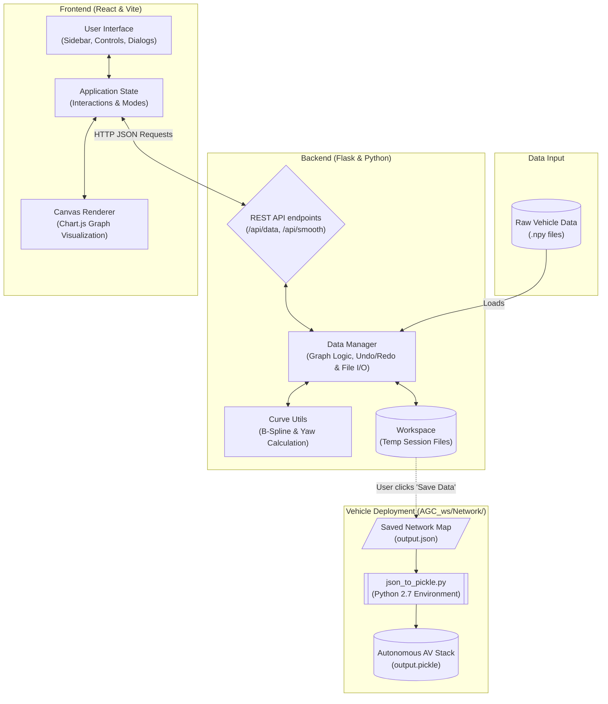

# Lane Mapping & Visualization Tool

A comprehensive tool for visualizing, editing, and refining lane graph data for autonomous vehicle navigation. This project has evolved from a desktop Python GUI to a modern Web Application with a React frontend and a Flask backend. It allows users to manage lane networks, smooth paths using splines, and verify graph connectivity.

## 🚀 Features

*   **Web-Based Interface:** Modern, responsive UI built with React and Vite.
*   **Graph-Based Data Model:** Treats lanes as nodes and edges, supporting complex junctions.
*   **Bidirectional Editing:** Algorithms for smoothing and pathfinding work in both forward and reverse directions.
*   **Advanced Curve Smoothing:** B-Spline interpolation for smooth path generation with adjustable smoothness and weights.
*   **Interactive Plotting:** High-performance canvas-based plotting (Chart.js) with zoom, pan, and selection capabilities.
*   **Session Persistence:** Automatically saves and loads working sessions.
*   **Zone Editing:** Modify lane IDs (zones) and indicators for selected nodes in bulk.
*   **Multi-file Merging:** Seamlessly load multiple raw data files into a single unified workspace.
*   **Undo/Redo History:** Robust history management for all graph operations.
*   **Yaw Verification:** Visual tools to verify the alignment of node yaw with edge direction.

## 🛠️ Quick Start

### Prerequisites

*   **Python 3.8+**
*   **Node.js 16+**

### 1. Backend Setup

Navigate to the backend directory and install dependencies:

```bash
cd web/backend
# Create a virtual environment (optional but recommended)
python -m venv venv
# Activate venv:
# Windows: venv\Scripts\activate
# Mac/Linux: source venv/bin/activate

pip install -r requirements.txt
```

Start the Flask server:

```bash
python app.py
```
The backend will run on `http://localhost:5001`.

### 2. Frontend Setup

Open a new terminal, navigate to the frontend directory, and install dependencies:

```bash
cd web/frontend
npm install
```

Start the development server:

```bash
npm run dev
```
The application will be accessible at `http://localhost:5173` (or the port shown in the terminal).

The application will be accessible at `http://localhost:5173` (or the port shown in the terminal).

## 📊 Analysis Tools

For information on recording vehicle data and analyzing runs, please see the [Analysis Module Documentation](analysis/README.md).

## 🏗️ Architecture Flow



## 📂 Project Structure

```text
LaneMappingTool
├── analysis/              # [Analysis Tools](analysis/README.md)
│   ├── recorded_data/     # Vehicle logs & graph data
│   ├── recording/         # [Recording Tools](analysis/recording/README.md)
│   ├── compare_pickles.py # Graph comparison script
│   └── ...
├── web/
│   ├── backend/           # Flask API & Python logic ([Documentation](web/backend/README.md))
│   │   ├── app.py         # Main entry point, API routes
│   │   ├── workspace/     # Working directory for saved sessions
│   │   ├── utils/         # Core logic
│   │   └── ...
│   └── frontend/          # React Application ([Documentation](web/frontend/README.md))
│       ├── src/           # Components & State
│       └── ...
├── lanes/                 # Raw input data (.npy files)
├── utils/                 # [Shared Python utilities](utils/README.md)
└── ...
```

## 🎮 Controls

### Mouse Interactions
*   **Left Click:** Select a single Node.
*   **Shift + Left Click:** Add Node to selection (Multi-select).
*   **Ctrl + Left Click:** Add a new Node. If clicked near an existing node, it connects to it.
*   **Right Click:** (Context Menu) Options to delete node or break links.
*   **Drag (Background):** Pan the view.
*   **Scroll:** Zoom in/out.

### Keyboard Shortcuts
*   **`d`**: Switch to **Draw Mode** (Click to place points, Enter to finish).
*   **`Delete` / `Backspace`**: Delete currently selected nodes.
*   **`Ctrl + Z`**: Undo last operation.
*   **`Ctrl + Y`**: Redo last undone operation.
*   **`Esc`**: Cancel current operation (e.g., drawing) or clear selection.
*   **`Enter`**: Confirm action (e.g., in Draw mode).

### Selection Modes (Sidebar)
*   **Box Select:** Click and drag to select nodes within a rectangular area.
*   **Path Select:** Click two nodes to select the shortest path between them.

## 📋 Deployment Workflow
**Steps to deploy the new Lane to the vehicle:**

1. **Save Data**:
   - Click the "Save Data" button in the web tool.
   - This creates `output.json` in `web/backend/workspace/`.

2. **Transfer Files**:
   - Copy `output.json` from your computer to the vehicle.
   - **Destination**: `AGC_ws/Network/` on the vehicle.

3. **Convert to Pickle (On Vehicle)**:
   - Ensure `json_to_pickle.py` is present in `AGC_ws/Network/`.
   - Run the conversion script using the vehicle's python (Python 2.7):
     ```bash
     python json_to_pickle.py output.json output.pickle
     ```
   - This generates the Python 2.6/2.7 and networkx compatible `.pickle` file required by the autonomous stack.

## 📝 Author

**Thippeswamy K.S.**
*GITAM Deemed to be University, Bengaluru*
