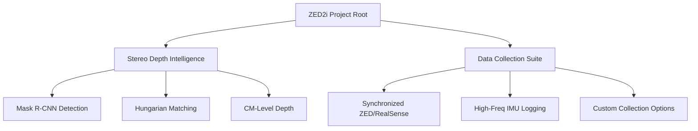

<div align="center">


# 🌌 ZED2i Perception & Data Intelligence
**Advanced Stereo Vision Pipeline & Synchronized Multi-Camera Acquisition**

[](https://www.python.org/)
[](https://www.stereolabs.com/)
[](https://pytorch.org/)

---
</div>

## 🔭 Project Overview

This repository serves as a professional-grade ecosystem for **StereoLabs ZED2i** and **Intel RealSense D435i** integration. It bridges the gap between raw spatial data acquisition and high-level AI perception.

### 🧩 Core Ecosystem



---

## 📂 Navigation & Modules

| Module | Description | Key Documentation |
| :--- | :--- | :--- |
| **Perception** | Deep learning based depth estimation using stereo pairs. | [🧠 Perception README](stereoImageProcessing/code/StereoCameraFindingDepth/README.md) |
| **Data Engine** | Synchronized multi-camera recording (ZED + RealSense). | [📹 Data Engine README](default/code/Working/README.md) |
| **Specialized** | Custom acquisition profiles for specific research. | [🛠️ Specialized README](default/code/Working/samsang/collectionData/README.md) |

---

## 🚀 Quick Start

> [!TIP]
> Ensure you have the ZED SDK and RealSense SDK installed on your system before running the collection scripts.

### 1. Synchronized Data Collection
```bash
# Capture from ZED and RealSense simultaneously
python default/code/Working/script.py --fps 30 --output_dir ./recordings
```

### 2. Stereo Depth Finding
```bash
# Analyze stereo images for object distances
python stereoImageProcessing/code/StereoCameraFindingDepth/Stereo_Image_All2.py
```

---

## 🛠️ Technology Stack

- **Computer Vision**: OpenCV, StereoLabs SDK (pyzed), Intel RealSense SDK (pyrealsense2)
- **Deep Learning**: PyTorch, Torchvision (Mask R-CNN ResNet50)
- **Data Science**: NumPy, Pandas, SciPy (Linear Sum Assignment)
- **Visualization**: Matplotlib

---
<div align="center">
Designed for precision spatial intelligence. 
</div>
