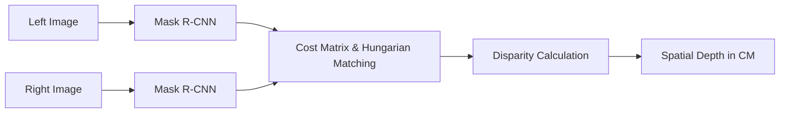

# 🧠 Stereo Perception & Depth Intelligence

This module implements a sophisticated object detection and depth estimation pipeline using stereo vision. By leveraging **Mask R-CNN** and **Disparity Analysis**, it translates 2D pixel coordinates into real-world spatial measurements.

---

## 🛠️ Perception Pipeline



## 📦 Key Components

### 🔬 AI Depth Analysis
- **`stereoimagedepthfinding.py`**: The core research implementation.
  - Uses **Mask R-CNN ResNet50 FPN V2** for instance segmentation.
  - Implements a custom **cost function** evaluating:
    - ↕️ Vertical displacement (scaled penalty)
    - ↔️ Horizontal movement (direction-aware)
    - 📐 Area consistency
  - Utilizes the **Hungarian Algorithm** (`linear_sum_assignment`) for optimal pairing.
- **`Stereo_Image_All2.py`**: Production-ready script with hardcoded calibration for specific focal lengths, providing instantaneous CM output.

### 📓 Interactive Development
- **`Stereo_Image_v_282.ipynb`** & **`Stereo_Image_v_167.ipynb`**: Visual playgrounds for tuning thresholds and inspecting segmentation masks.

### 📸 Acquisition
- **`ZedLeftRightImageCapture.py`**: High-performance capture utility.
  - **Hotkey 'S'**: Save synchronized image pairs.
  - **Hotkey 'Q'**: Safe exit and camera release.

---

## ⚙️ Configuration & Requirements

> [!IMPORTANT]
> The depth finding accuracy is highly dependent on the `FocalLength` and `tanTheta` parameters in `Stereo_Image_All2.py`. Adjust these based on your specific ZED2i calibration.

### Dependencies
```bash
pip install torch torchvision opencv-python scipy matplotlib numpy
```

---

## 📊 Logic Visualization

The tracking cost $C$ is calculated as:
$$C = \gamma \cdot |V_{dist}| + \beta \cdot |H_{dist}|_{penalized} + \frac{A_{diff}}{\alpha}$$

Where:
- $\gamma$ = Vertical penalty (Objects shouldn't shift vertically)
- $\beta$ = Horizontal move penalty (Enforces stereo geometry)
- $\alpha$ = Area normalization factor
