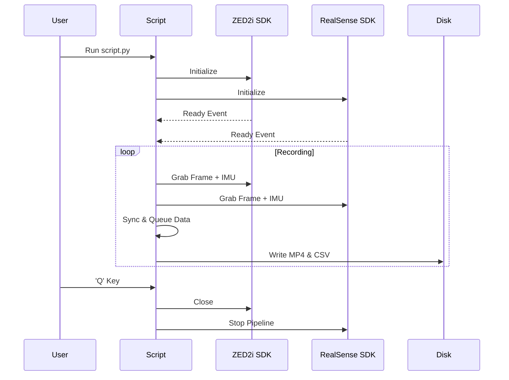

# 📹 Synchronized Data Engine

A high-performance acquisition layer designed for multi-sensor synchronization between **StereoLabs ZED2i** and **Intel RealSense D435i**.

---

## 🌟 Key Features

- **⏱️ Precise Synchronization**: Uses threaded event listeners to initialize and grab frames across different SDKs simultaneously.
- **💾 Multi-Stream Recording**:
  - **RGB**: High-definition color streams.
  - **Depth**: Normalized depth maps with JET colormap application.
  - **IR**: Left/Right Infrared streams from RealSense.
- **🛰️ IMU & Positional Fusion**: Logs 6-DOF data (Acceleration, Angular Velocity, World Position) at high frequencies.

---

## ⌨️ Command Line Interface

### `script.py` Usage

| Argument | Type | Default | Description |
| :--- | :--- | :--- | :--- |
| `--output_dir` | `str` | `./Data2` | Root directory for the current session. |
| `--resolution` | `str` | `HD1080` | ZED resolution (`HD720`, `HD1080`, `HD2K`). |
| `--fps` | `int` | `30` | Target framerate for both cameras. |
| `--depth_mode` | `str` | `ULTRA` | ZED depth quality (`PERFORMANCE`, `ULTRA`). |

---

## 🏗️ System Architecture



---

## 📂 Output Structure

Every session generates a uniquely timestamped/versioned folder structure:
```text
Data2/
├── ZED2i_Data_X/
│   ├── ZED_ColorVideo.mp4
│   ├── ZED_DepthVideo.mp4
│   └── imu_data.csv
└── RealSense_D435i_X/
    ├── RS_ColorVideo.mp4
    ├── RS_DepthVideo.mp4
    └── imu_data.csv
```

> [!TIP]
> For best synchronization, ensure both cameras are connected to USB 3.0 ports on the same controller.
