# AutoSegmentor: Architecture and Workflow Guide

This document provides a comprehensive technical overview of the AutoSegmentor system, covering its modular architecture, async threading model, and end-to-end data workflow.

---

## 🏗️ System Architecture

AutoSegmentor is designed as a reactive, UI-driven desktop application. It transitions from a linear script-based pipeline to a modular, package-based architecture that separates the graphical interface from heavy machine learning computations.

### Master System Architecture

```mermaid
flowchart TD
    %% =========================================================
    %% Swimlanes (vertical pipeline)
    %% =========================================================

    subgraph "User / HITL (Human-in-the-loop)"
        U["User / Annotator"]:::external
        UI["PyQt5 MainWindow / UI\n(MainWindow.py)\npoints, zoom, sidepanel"]:::ui
        AM["AnnotationManager\nsave/load prompts, keypoints"]:::ui
        LOG["Logging\n(logger_config.py)"]:::ui
        JP[("User Prompts JSON\npoints_labels_*.json")]:::store
    end

    subgraph "Orchestration / Control Plane"
        DRIVER["Main Entry\nrun_demo.py"]:::orch
        SETUP["Setup Dialog\n(SetupDialog.py)"]:::ui
        PIPE["Pipeline Orchestrator\n(pipeline.py)\ncoordinates extraction+engine"]:::orch
        ENGINE["AutoSegmentor Engine\n(AutoSegmentorEngine.py)\ncore processing logic"]:::orch
        CFG["Runtime Config\n(default_config.yaml)\nvideo_range, batch, dirs"]:::doc
    end

    subgraph "Input / Output Artifacts (Data Plane)"
        VIN[("Video Inputs\nVideo*.mp4")]:::store
        WDIR[("workspace/working_dir/\nimages, masks, overlap")]:::store
        WOUT[("workspace/outputs/\nOrgVideo*.mp4\nMaskVideo*.mp4")]:::store
        OUTLOG[("outputs/logs/\nautosegmentor.log")]:::store
        CKPT[("SAM2 Checkpoint\nsam2_hiera_large.pt")]:::store
    end

    subgraph "FileManagement (ETL stages)"
        FM["FileManager\ndir lifecycle & paths"]:::fm
        FE["FrameExtractor\nvideo->frames"]:::fm
        MP["MaskProcessor\ncolor-encode, batch render"]:::fm
        OVL["ImageOverlayProcessor\nmask-over-image blending"]:::fm
        CP["ImageCopier\ncurate verified samples"]:::fm
        VC["VideoCreator\nframes->mp4 assembly"]:::fm
    end

    subgraph "Pose Estimation & Tracking"
        PTRACK["Pose Exporter\n(PoseExporter.py)"]:::fm
        CT["CoTracker Wrapper\n(CoTrackerPredictor.py)"]:::ml
        LK["Optical Flow (LK)\n(LKKeypointTracker.py)"]:::ml
        CT_LIB["CoTracker Library\n(external/co-tracker/)"]:::ml
        CT_CKPT[("CoTracker Weights\nscaled_offline.pth")]:::store
    end

    subgraph "Model Runtime (SAM2 Inference)"
        S2CFG["AppConfig\nbatch size, paths"]:::ml
        S2M["SAM2Model\nload weights, device selection"]:::ml
        PRED["sam2_video_predictor\nprompts+batch inference"]:::ml
        S2LIB["SAM2 Library (vendored)\n(external/segment_anything_2/)"]:::ml
        GPU{{"PyTorch + CUDA GPU Runtime"}}:::gpu
    end

    subgraph "Dataset Export (YOLO compatible)"
        YDC["YOLO Dataset Builder\n(DatasetCreator.py)\npolygons, split, augment"]:::ds
        YSTRUCT["YOLO Structure Creator\ncreate_yolo_structure.py"]:::ds
        YDOC["Docs\nREADME.md"]:::doc
        YOLO[("YOLO Dataset Folder\ntrain/valid/test\nlabels(polygons).txt")]:::store
    end

    %% =========================================================
    %% Control-plane flows
    %% =========================================================
    U -->|"interaction"| UI
    UI -->|"update/save"| AM
    AM -->|"persist"| JP
    UI -->|"logs"| LOG

    CFG -->|"load params"| PIPE
    DRIVER -->|"launch"| UI
    UI -->|"orchestrates"| PIPE

    MCFG -->|"model config"| S2CFG
    CKPT -->|"weights"| S2M
    S2CFG -->|"batch/paths"| PRED
    S2M -->|"predictor init"| PRED
    JP -->|"prompts"| PRED

    %% =========================================================
    %% Data-plane pipeline (ETL)
    %% =========================================================
    VIN -->|"mp4 source"| FE
    PIPE -->|"triggers"| FM
    PIPE -->|"triggers"| FE
    PIPE -->|"triggers"| PRED
    PIPE -->|"triggers"| MP
    PIPE -->|"triggers"| OVL
    PIPE -->|"triggers"| CP
    PIPE -->|"triggers"| VC
    PIPE -->|"triggers"| YDC

    FE -->|"frames(jpeg)"| WDIR
    FM -->|"lifecycle"| WDIR

    WDIR -->|"images/masks"| PRED
    PRED -->|"raw logits"| MP
    MP -->|"color masks"| WDIR

    WDIR -->|"images+render"| OVL
    OVL -->|"overlap frames"| WDIR

    WDIR -->|"verified curate"| CP
    CP -->|"verified subset"| WDIR

    WDIR -->|"assembly"| VC
    VC -->|"mp4 outputs"| OUTVID

    WDIR -->|"verified export"| YDC
    YDC -->|"builds"| YSTRUCT
    YSTRUCT -->|"YOLO format"| YOLO

    %% =========================================================
    %% Pose Estimation Flows
    %% =========================================================
    WDIR -->|"frames"| PTRACK
    PTRACK -->|"selects"| CT
    PTRACK -->|"selects"| LK
    CT -->|"imports"| CT_LIB
    CT_CKPT -->|"loads"| CT
    PTRACK -->|"pose data"| WDIR

    %% =========================================================
    %% Compute/resource dependencies
    %% =========================================================
    PRED -->|"inference"| S2LIB
    PRED -->|"gpu tasks"| GPU

    %% =========================================================
    %% Click Events
    %% =========================================================
    click DRIVER "run_demo.py" "Main Entry"
    click PIPE "autosegmentor/pipeline.py" "Pipeline Orchestrator"
    click ENGINE "autosegmentor/core/AutoSegmentorEngine.py" "Engine Core"
    click CFG "workspace/inputs/config/default_config.yaml" "Config File"
    click AM "autosegmentor/ui/AnnotationManager.py" "Annotation Manager"
    click UI "autosegmentor/ui/MainWindow.py" "Main UI"
    click FM "autosegmentor/file_management/FileManager.py" "File Manager"
    click FE "autosegmentor/file_management/FrameExtractor.py" "Frame Extractor"
    click MP "autosegmentor/file_management/MaskProcessor.py" "Mask Processor"
    click OVL "autosegmentor/file_management/ImageOverlayProcessor.py" "Overlay Processor"
    click VC "autosegmentor/file_management/VideoCreator.py" "Video Creator"
    click CT "autosegmentor/models/Tracking/CoTrackerPredictor.py" "CoTracker"
    click S2M "autosegmentor/models/SAM/SAM2Model.py" "SAM2 Model"
    click YDC "DatasetManager/YolovDatasetManager/DatasetCreator.py" "Dataset Creator"
    click S2LIB "https://github.com/facebookresearch/segment-anything-2" "SAM2 GitHub"
    click CT_LIB "https://github.com/facebookresearch/co-tracker" "CoTracker GitHub"

    %% =========================================================
    %% Styles
    %% =========================================================
    classDef orch fill:#1e88e5,stroke:#0d47a1,color:#ffffff,stroke-width:1px
    classDef ui fill:#43a047,stroke:#1b5e20,color:#ffffff,stroke-width:1px
    classDef ml fill:#fb8c00,stroke:#e65100,color:#ffffff,stroke-width:1px
    classDef fm fill:#26a69a,stroke:#004d40,color:#ffffff,stroke-width:1px
    classDef ds fill:#8e24aa,stroke:#4a148c,color:#ffffff,stroke-width:1px
    classDef store fill:#90a4ae,stroke:#37474f,color:#0b0f12,stroke-width:1px
    classDef doc fill:#cfd8dc,stroke:#455a64,color:#0b0f12,stroke-width:1px
    classDef gpu fill:#6d4c41,stroke:#3e2723,color:#ffffff,stroke-width:1px
    classDef tool fill:#546e7a,stroke:#263238,color:#ffffff,stroke-width:1px
    classDef external fill:#2b2b2b,stroke:#111111,color:#ffffff,stroke-width:1px
```

### 1. Package Structure: `autosegmentor/`

The core logic is organized into specialized subpackages to maintain a clean separation of concerns:

| Component Category | Module | Responsibility |
| :--- | :--- | :--- |
| **UI Layer** | `MainWindow.py` | Primary PyQt5 hub. Manages toolbar, menus, status bar, and central splitter. |
| | `AnnotationCanvas.py` | Handles image rendering, zoom/pan math, and vector drawing for annotations. |
| | `SidePanel.py` | Reactive property panel for classes, instances, and keypoint visibility. |
| | `NavigationManager.py` | Implements the **Command Pattern** for a robust Undo/Redo stack. |
| **Logic Layer** | `pipeline.py` | Main orchestrator that coordinates extraction, engine initialization, and post-processing. |
| | `AutoSegmentorEngine.py` | Core processing engine that manages the SAM2 state and UI interaction loops. |
| | `main_app.py` | Bootstraps the application, launches the SetupDialog, and starts the pipeline. |
| **Model Layer** | `SAM2Model.py` | Low-level wrapper for loading weights and managing SAM2 GPU inference state. |
| | `CoTrackerPredictor.py` | Integration for temporal keypoint tracking across frame batches. |
| | `LKKeypointTracker.py` | Fallback Lucas-Kanade optical flow implementation for simpler scenes. |
| **Data Layer** | `FileManager.py` | Centralized utility for path resolution and directory lifecycle management. |
| | `FrameExtractor.py` | Optimized video-to-image extraction using OpenCV. |
| | `MaskProcessor.py` | Post-processes binary model logits into color-mapped, verifiable PNG masks. |
| | `VideoCreator.py` | Multi-threaded assembly of processed frames into deliverable MP4 files. |

---

---

## 🧵 The Async Threading Model

To ensure a smooth user experience, AutoSegmentor utilizes a multi-threaded architecture. Heavy GPU and I/O tasks are offloaded from the Main UI thread using PyQt's `QThread` system.

### `PreviewThread`
- **Purpose**: Provides real-time visual feedback for the currently edited frame.
- **Trigger**: Fired 500ms after a user stops navigating or immediately after a point is added/moved.
- **Operation**: Runs a single-frame SAM2 inference and updates the `AnnotationCanvas` via `pyqtSignal`.

### `BatchProcessorThread`
- **Purpose**: Handles long-running propagation and tracking tasks.
- **Trigger**: Fired when the user clicks "Process Batch" (or presses Enter).
- **Operation**: 
    1. Propagates the current frame's mask across the entire batch using SAM2.
    2. Runs CoTracker to track keypoints across the temporal window.
    3. Persists results to disk and updates the UI state once finished.

---

## 🔄 The End-to-End Workflow

The journey from a raw video file to a verified training dataset follows a structured lifecycle.

### 1. Project Initialization
- **Entry Point**: `run_demo.py`.
- **Config**: Settings are loaded from `workspace/inputs/config/default_config.yaml`.
- **Setup**: The user selects the target video and configures model parameters in the `SetupDialog`.

### 2. Frame Extraction
- The system uses `FrameExtractor` to decode the video into high-quality JPEG images.
- Images are stored in `workspace/working_dir/images/` for random access by the UI.

### 3. Interactive Annotation
- The user navigates the video using **A/D** (single frame) or **Shift+A/D** (turbo-scroll).
- **Prompts**: Visual prompts (foreground/background points) are captured by the `AnnotationCanvas`.
- **Undo/Redo**: Every action is recorded in a `QUndoStack`, allowing for complex correction workflows.

### 4. Background Propagation
- Once prompts are set for a keyframe, the `BatchProcessorThread` extends the segmentation to surrounding frames.
- **CoTracker** ensures that even small, fast-moving objects are tracked accurately, providing a robust base for the segmentation model.

### 5. Verification and Export
- Overlays are generated in real-time or batch mode for visual quality control.
- **Export Dialog**: The user selects which classes and segments to export.
- **Dataset Synthesis**: The `DatasetManager` takes over, converting masks into YOLO-format polygons and applying augmentations to generate a training-ready dataset.

---

## 📦 Output Specifications
 
 The pipeline generates several types of outputs, organized into intermediate working files and final deliverables.
 
 ### 1. File Formats & Naming
 - **Images**: Standard `.jpg` or `.jpeg` extracted by `FrameExtractor`.
     - Naming: `{prefix}{video_number}_{frame_index:05d}.jpeg`.
 - **Masks**: Color-mapped PNGs.
     - These use a predefined palette to distinguish instances (up to 10 unique IDs).
     - Generated by `MaskProcessor.binary_mask_2_color_mask`.
 - **Videos**: High-quality `.mp4` files encoded with the `mp4v` codec.
 
 ### 2. Directory Hierarchy
 - **`workspace/working_dir/`** (Intermediate):
     - `images/`: Raw extracted frames.
     - `render/`: Color segmentation masks.
     - `overlap/`: Visualization overlays for quality control.
     - `temp/`: Temporary batch staging area.
 - **`workspace/working_dir/verified/`** (Final):
     - `images/`: Frames explicitly verified by the user.
     - `mask/`: Corresponding verified masks.
 - **`workspace/outputs/`**: Reconstructed videos (`OrgVideo`, `MaskVideo`, `OverlappedVideo`).
 - **`outputs/logs/`**: System runtime logs (`autosegmentor.log`).
 
 ---
 
 ## 🚀 Downstream Integration: Dataset Creation
 
 Once the annotation pipeline is complete, the `DatasetManager` suite takes over to prepare data for model training.
 
 ### `YolovDatasetManager` Workflow
 1. **Input**: Consumes verified images and masks from the workspace.
 2. **Polygon Extraction**: Converts color masks into precise polygon coordinates normalized for YOLO format (0-1).
 3. **Augmentation**: Applies transform operations (brightness, contrast, noise, blur) to multiply the dataset size (e.g., 10x per reference image).
 4. **Export**: Generates a structured YOLO dataset with `train`, `valid`, `test` splits and a `data.yaml` configuration file.

---

## 🛠️ Key Technical Mechanisms

### Bounding Box Auto-Refinement
To stabilize segmentation, the system calculates the bounding box of the current SAM2 mask and feeds it back into the model as a new prompt. This "self-correction" loop significantly improves mask consistency across difficult frames.

### Batch-Aware Memory Management
Instead of loading the entire video into VRAM, AutoSegmentor processes frames in configurable batches (e.g., 24 or 48 frames). This allows it to handle very long videos (minutes or hours) on consumer-grade hardware.

### Keypoint Visibility Logic
For pose estimation, the system tracks the visibility of each keypoint. If a keypoint is occluded by another object or leaves the frame, the `SyntheticEngine` automatically updates the visibility flags (0=hidden, 1=occluded, 2=visible) to maintain dataset integrity.
