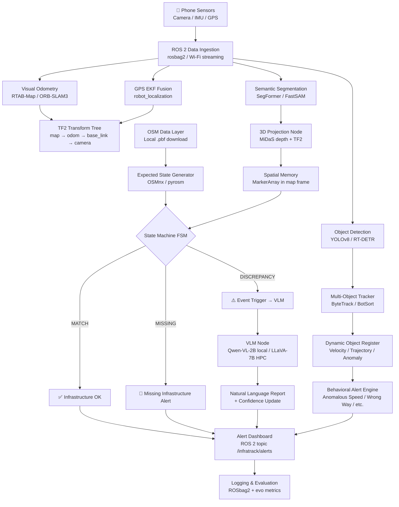

# InfraTrack ADAS — Deep Analysis, Improvements & Loophole Report

> **Conversation Reference:** `3ad2a757` | **Author:** Antigravity AI | **Date:** 2026-05-17

---

## 1. Formalized Project Objective (Improved)

**InfraTrack ADAS** is an onboard, camera-first Advanced Driver Assistance System that performs two parallel jobs:

| Job | What it does |
|-----|-------------|
| **Static Infrastructure Audit** | Compares *what should be on this road* (from OSM + municipal rules) against *what the camera actually sees* (semantic segmentation + depth estimation). Flags missing signs, phantom signs ("ghost signage"), and damaged road furniture. |
| **Dynamic Behavioral Monitoring** | Tracks every vehicle and pedestrian in the scene using multi-class object detection + a bounding-box tracker. Computes relative velocity, trajectory prediction, and flags anomalous driving (e.g., wrong-way driving, sudden lane changes). |

Both jobs share a **Spatial Memory** layer — a persistent, frame-to-frame register of object positions in the `odom` frame, maintained by a continuous state machine fused with Visual Odometry (VO).

The system targets two compute tiers:
- **Local (ASUS VivoBook, RTX 3050 4 GB VRAM):** Live/rosbag debugging, logic validation
- **HPC (A100 cluster):** Full-scale global pose graph optimization, large VLM reasoning

---

## 2. Critical Loopholes & Gaps Found in the Original Plan

> [!CAUTION]
> These are not minor issues. Each one can **block the entire pipeline** if not addressed before writing code.

### 🔴 Loophole 1 — No Sensor Specification
**Problem:** The plan says "mobile phone" for camera/IMU/GPS, but never specifies:
- Which phone model (affects IMU noise model, camera intrinsics)
- Whether you will use the front or rear camera
- Whether the phone is fixed (dashcam-style) or handheld
- What GPS accuracy you expect (~3–15 m for phone GPS)

**Impact:** Your entire calibration pipeline (intrinsics, extrinsics, IMU noise model for VO) depends on this. Phone GPS at 5–15 m accuracy is **insufficient** for meter-level infrastructure localization.

**Fix:** Decide early. Options:
- Phone + external RTK-GPS (ArduSimple, SparkFun) for cm-level accuracy
- Phone camera + LiDAR (if budget allows, like iPad Pro LiDAR or Ouster OS0)
- Or explicitly accept ±5 m accuracy and design OSM correlation with a tolerance buffer

---

### 🔴 Loophole 2 — Camera Calibration Is Missing from the Plan
**Problem:** Every 2D→3D projection step (the "Projection" step mentioned at the end) requires known camera intrinsics (`K` matrix, distortion coefficients) and extrinsics (camera pose relative to vehicle).

**Impact:** Without this, your `tf2` transforms are **mathematically wrong**. A 10-pixel error in the principal point causes meter-scale errors in 3D localization.

**Fix:** Add a mandatory **Calibration Phase (Phase 0)** before any perception work:
1. Print a ChArUco board
2. Use `camera_calibration` ROS 2 package or OpenCV to compute `K` and `D`
3. Perform a hand-eye calibration if combining with IMU

---

### 🔴 Loophole 3 — OSM Data Is Static; Roads Are Dynamic
**Problem:** The plan treats OSM as ground truth for "expected environmental state." But OSM data can be:
- Out of date by months or years
- Missing speed bumps entirely (they are rarely mapped)
- Wrong about sign positions by 5–20 meters

**Impact:** Your "Missing Infrastructure Alert" will fire **constantly** on correct roads that are simply not in OSM, creating a flood of false positives that makes the system unusable.

**Fix:** Design a **confidence-weighted discrepancy** model, not a binary match:
- OSM match → confidence +0.8
- VLM confirms no sign visually → confidence +0.9
- Alert only when confidence > threshold (e.g., 0.85)
- Add a **feedback loop**: verified detections that are not in OSM are submitted back as OSM edit candidates

---

### 🔴 Loophole 4 — VO Drift Is Not Bounded
**Problem:** Visual Odometry (VO) is used as the backbone of spatial memory. But VO **drifts** — accumulated error grows with distance. Over 100 m, a typical monocular VO can drift 1–3% of path length (1–3 meters of error).

**Impact:** A speed breaker marker planted at position A will appear to move over time as VO drifts. After 500 m, your markers will be misaligned by 5–15 m, making the OSM correlation meaningless.

**Fix:**
- Use GPS to periodically **re-anchor** the VO drift (GPS-VO fusion via `robot_localization` EKF)
- Use loop-closure detection (already in RTAB-Map) to correct accumulated drift
- Keep a `confidence radius` for each marker that grows with distance traveled since last anchor

---

### 🔴 Loophole 5 — State Machine Is Undefined
**Problem:** The plan mentions a "continuous state machine" but never defines:
- What are the states? (e.g., `CANDIDATE`, `VERIFIED`, `GHOST`, `MISSING`)
- What are the transition conditions? (confidence score? frame count? GPS proximity?)
- How are conflicting states handled? (e.g., OSM says sign exists, vision says absent)

**Impact:** Without a formal state machine design, two developers will implement it differently, and you cannot unit-test it.

**Fix:** Define a formal FSM (see Section 4 below).

---

### 🟡 Loophole 6 — No Data Association Strategy for Dynamic Objects
**Problem:** The "bounding-box tracker" is mentioned but which tracker is not specified. More importantly, no strategy exists for:
- What happens when the tracker loses a vehicle behind an occlusion?
- How are vehicle IDs kept stable across frames?
- How is a "parked car" distinguished from a "stopped car" from a "slow-moving car"?

**Fix:** Specify the tracker (ByteTrack or BotSort are recommended for ADAS use cases) and define velocity thresholds:
- `|v| < 0.5 m/s for T > 30s` → classify as parked
- `|v| > 20 m/s on a 30 zone road` → flag anomaly

---

### 🟡 Loophole 7 — VLM Integration Has No Latency Budget
**Problem:** VLMs (LLaVA, Qwen-VL) take 1–10 seconds per inference even on good GPUs. The plan says the VLM will "monitor driving behavior and condition of other vehicles" but doesn't say:
- How often is the VLM called?
- Is it called per-frame, per-event, or on-demand?
- What is the fallback if VLM is too slow?

**Impact:** If VLM is called per-frame at 30 FPS, it needs to run in <33ms. LLaVA-7B on an RTX 3050 takes ~2000ms. This **will not work**.

**Fix:** VLM must be **event-triggered**, not frame-triggered:
- Trigger VLM only when the state machine flags a `CANDIDATE` or `DISCREPANCY` event
- VLM is called asynchronously in a separate thread/node
- Main pipeline continues processing; VLM result arrives later and updates confidence scores

---

### 🟡 Loophole 8 — Path Estimation / Global Navigation Is Underspecified
**Problem:** "Integrate OSM for global path, based on start lat/lon" is one line. This is actually a non-trivial subsystem:
- What is the destination? How is it specified?
- Which routing algorithm? (Dijkstra on OSM graph, A*, OSRM API?)
- Is it turn-by-turn navigation, or just a reference path for map-matching?
- How does the path update if the road is blocked?

**Fix:** Clarify the role of path estimation. Recommended split:
- **Online (phone GPS + OSRM):** Download and query local OSRM instance for a reference polyline
- **Offline fallback:** Pre-download OSM `.pbf` for the operational area and use `pyrosm` or `networkx` + OSM graph locally

---

### 🟡 Loophole 9 — No Coordinate Frame Convention Documented
**Problem:** The plan mixes `odom`, `map`, `base_link`, `camera` frames without defining which frame is authoritative for each data type.

**Fix:** Establish a frame convention document:
```
world (ENU, GPS anchor)
  └── map (SLAM origin)
        └── odom (VO-corrected)
              └── base_link (vehicle center)
                    ├── camera_link
                    └── imu_link
```
- Infrastructure markers → stored in `map` frame
- Dynamic objects → tracked in `odom` frame, reported in `map` frame
- OSM data → converted to `map` frame via GPS anchor

---

### 🟡 Loophole 10 — Docker → Apptainer Conversion Assumes Identical CUDA Versions
**Problem:** The plan says "convert Docker to Apptainer for HPC." But HPC clusters often have:
- A specific CUDA driver version (e.g., 12.2) that may not match your local Docker image (e.g., built with CUDA 11.8)
- No root access for `apptainer build` — requires `--fakeroot` or pre-built SIF
- Different MPI libraries if you plan distributed processing

**Fix:** Check HPC CUDA driver version first. Build your Docker image with CUDA 12.x if the HPC runs CUDA 12.x drivers.

---

### 🟠 Loophole 11 — No Failure Mode / Safety Layer
**Problem:** This is an ADAS system. The plan has no mention of:
- What happens if the camera feed drops?
- What happens if GPS loses fix?
- What happens if SLAM diverges?
- Is there a watchdog that triggers a safe-state?

**Fix:** Define a **Degraded Mode** for each failure:
| Failure | Degraded Behavior |
|---------|-------------------|
| Camera drop | Disable all vision alerts; maintain last known markers |
| GPS loss | Switch to pure VO; expand marker confidence radius |
| SLAM diverge | Freeze global map; alert driver; use local-only VO |
| VLM timeout | Skip VLM confirmation; log event for offline review |

---

### 🟠 Loophole 12 — No Evaluation / Ground Truth Strategy
**Problem:** How will you know if your system is working correctly? The plan has no mention of:
- What metrics define success? (Precision/Recall for infrastructure detection? MOTP/MOTA for tracking?)
- What is the ground truth? (manually annotated rosbags? public datasets?)
- How will you measure VO drift?

**Fix:** Define evaluation from Day 1:
- Use **nuScenes** or **KITTI** as ground truth for detection/tracking (they have 3D annotations)
- Use the `evo` ROS 2 package to measure VO drift against GPS ground truth
- Track at minimum: Detection F1, Tracker MOTA, VO ATE (Absolute Trajectory Error)

---

## 3. Improved Full Pipeline Architecture



---

## 4. Formal State Machine Definition (Loophole 5 Fix)

```
States:
  UNOBSERVED   - OSM says object should exist, not yet seen
  CANDIDATE    - Seen once in camera, not yet confirmed
  VERIFIED     - Seen in ≥3 frames with consistent VO position (Δpos < 0.5m)
  GHOST        - OSM says absent, but we see it consistently (phantom signage)
  MISSING      - OSM says present, but VERIFIED absence over ≥5 frames
  DEGRADED     - Sensor failure, marker frozen

Transitions:
  UNOBSERVED  → CANDIDATE  : First detection within GPS proximity (< 20m radius)
  CANDIDATE   → VERIFIED   : 3+ consistent frames, VO drift < 0.5m, depth confidence > 0.7
  CANDIDATE   → UNOBSERVED : Not seen for 10 frames (false detection)
  VERIFIED    → MISSING    : Object absent for 5+ consecutive verified frames
  VERIFIED    → GHOST      : Object present but not in OSM within 10m radius
  ANY         → DEGRADED   : Camera/GPS/SLAM failure signal received
  DEGRADED    → last state : Sensor recovery confirmed
```

---

## 5. Phased Development Roadmap

### Phase 0 — Foundation (Week 1–2)
- [ ] Fix sensor platform: which phone, how mounted, how streamed
- [ ] Camera intrinsic calibration (ChArUco board)
- [ ] IMU noise model calibration (`imu_utils`)
- [ ] Download OSM `.pbf` for test area; set up `osmium` + `pyrosm`
- [ ] Set up `robot_localization` EKF node (GPS + IMU fusion)

### Phase 1 — Perception Core (Week 3–5)
- [ ] Deploy YOLOv8n (nano) + ByteTrack for dynamic objects (fits in 4GB VRAM)
- [ ] Deploy SegFormer-B0 (lightweight) for semantic segmentation
- [ ] Deploy MiDaS v2.1 small for monocular depth
- [ ] Validate 2D → 3D projection accuracy using known test objects

### Phase 2 — Spatial Memory (Week 6–8)
- [ ] Implement `MarkerArray` publisher with marker lifecycle
- [ ] Implement the FSM node (pure Python or C++)
- [ ] Implement OSM expected-state loader
- [ ] Wire FSM: UNOBSERVED → CANDIDATE → VERIFIED → MISSING/GHOST

### Phase 3 — VLM Integration (Week 9–11)
- [ ] Deploy Qwen-VL-2B locally (fits in ~3.5GB VRAM with 4-bit quant)
- [ ] Implement async VLM event handler
- [ ] VLM prompt engineering: road quality, sign condition, driver behavior

### Phase 4 — Evaluation & HPC Transition (Week 12–14)
- [ ] Run against nuScenes/KITTI data for quantitative evaluation
- [ ] Measure VO drift with `evo_ape`
- [ ] Build Docker image, test Apptainer conversion
- [ ] Run global pose graph optimization on HPC

---

## 6. Recommended Tech Stack

| Component | Local (RTX 3050 4GB) | HPC (A100) |
|-----------|----------------------|------------|
| Object Detection | YOLOv8n (TensorRT) | YOLOv8l / RT-DETR |
| Segmentation | SegFormer-B0 | SegFormer-B5 |
| Depth | MiDaS v2.1 small | ZoeDepth |
| VO / SLAM | RTAB-Map (monocular) | LIO-SAM or RTAB-Map stereo |
| Tracker | ByteTrack | ByteTrack |
| VLM | Qwen-VL-2B (4-bit) | LLaVA-13B or Qwen-VL-7B |
| OSM Routing | pyrosm + networkx | OSRM local server |
| GPS Fusion | robot_localization EKF | same |
| Evaluation | evo, nuScenes devkit | same |

---

## 7. Open Questions — I Need Your Input

> [!IMPORTANT]
> These questions **directly affect the architecture**. Please answer them so I can help you build the right thing.

1. **Sensor Platform:** Which phone model are you using? Will it be mounted on the dashboard, or handheld? Do you have access to an external GPS module?

2. **Operational Area:** What city/area are you targeting? This determines whether good OSM data exists for speed bumps in your region.

3. **Real-time vs. Offline:** Is the system meant to run live while driving (hard real-time), or will you always record a rosbag and process it later (offline)? This changes the latency requirements dramatically.

4. **VLM Goal:** Do you want the VLM to produce a **text report** (e.g., "The road surface has significant pothole damage near marker #47"), or a **structured output** (e.g., JSON with severity score)? This affects prompting strategy.

5. **Output / End User:** Who reads the final alerts? Is it a dashboard in the car, a backend server, a mobile app, or a research database?

6. **SLAM Choice:** Do you have a stereo camera or just monocular? Stereo (even phone front+rear) eliminates scale ambiguity in monocular VO — a critical improvement.

7. **Dataset First vs. Live First:** Do you want to start with nuScenes/KITTI data (safer, immediate feedback) or with your own phone recordings (more realistic but harder to debug)?

---

## 8. Summary of Key Improvements Made

| Original Plan | Improved Plan |
|--------------|---------------|
| "Mobile phone" sensors | Define exact sensor + calibration pipeline |
| Binary OSM match/no-match | Confidence-weighted discrepancy model |
| Vague "state machine" | Formal 6-state FSM with defined transitions |
| VO as sole spatial anchor | VO + GPS EKF fusion to bound drift |
| "VLM monitors everything" | Event-triggered async VLM calls only |
| No evaluation strategy | nuScenes/KITTI baseline + evo metrics |
| No failure modes | Degraded mode table for each failure type |
| One-line path estimation | OSRM local server + OSM graph routing |
| No coordinate frame doc | Full TF2 frame tree defined |
| Docker → HPC assumed easy | CUDA version check + fakeroot Apptainer build |
