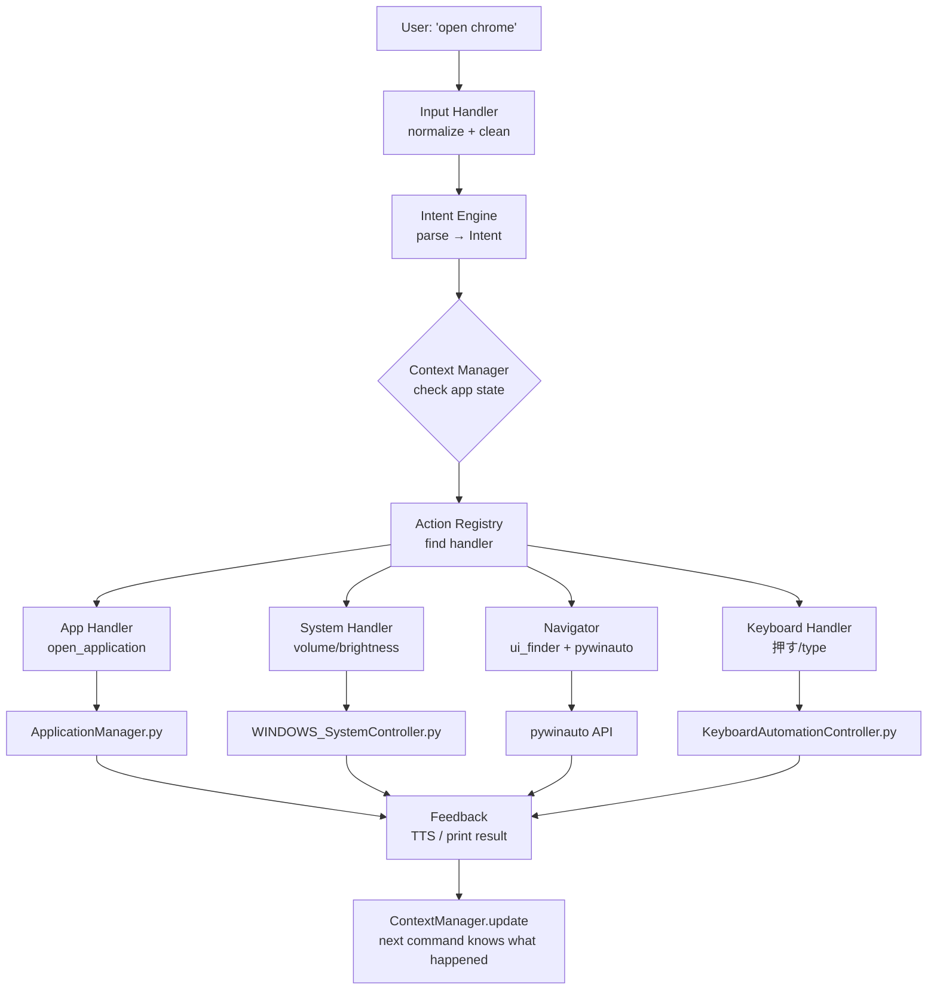

# Jarvis AI Control System — Architecture & Build Plan

A complete redesign of the Jarvis command system to be **smart, extensible, and capable of in-app navigation** — all through code, no hardcoded keyword lists.

---

## What Already Exists (Keep As-Is)

These modules work well and become the *action library* layer:

| Module | Role |
|--------|------|
| `ApplicationManager.py` | Open/close apps via process & path |
| `SystemFilePathScanner.py` | Scans for installed `.exe` / `.lnk` files |
| `KeyboardAutomationController.py` | pyautogui keyboard: press, hold, type |
| `WindowsFeature/WINDOWS_SystemController.py` | Brightness, volume, window snap/minimize/maximize |
| `WindowsDefaultApps/settingControlApp.py` | Windows Settings navigation |
| `SpeechRecognition.py` | TTS + speech-to-text |

---

## The Core Problem with Current Architecture

The current `CommandProcessor.py` uses a brittle **keyword-match** pattern:
```python
if op_parts[0] in cls.open_app_cmds:  # only "open", "start", "run", "launch"
```
This means:
- "open chrome" ✅  "please open chrome" ❌  "get chrome running" ❌
- Adding a new command type = editing CommandProcessor + Data1.json
- No concept of what app is currently open
- No way to click buttons or navigate *inside* an open app

---

## New Architecture Overview

```
User Text/Speech Input
        │
        ▼
┌─────────────────────┐
│   Input Handler     │  ← text or speech (future) normalization
└─────────────────────┘
        │
        ▼
┌─────────────────────┐
│   Intent Engine     │  ← parses: {action, target, params, raw}
│  (rule-based NLP)   │  ← later: swap in LLM here
└─────────────────────┘
        │
        ▼
┌─────────────────────┐
│  Context Manager    │  ← knows: active app, mode, session state
└─────────────────────┘
        │
        ▼
┌─────────────────────┐
│  Action Router      │  ← finds best handler from Action Registry
│  (Action Registry)  │
└─────────────────────┘
        │
     ┌──┴──────────────────────────────────────────┐
     ▼                    ▼                         ▼
┌──────────┐     ┌──────────────────┐     ┌──────────────────┐
│App Handler│    │  System Handler  │     │  App Navigator   │
│open/close │    │vol/brightness/win│     │ pywinauto UI     │
└──────────┘     └──────────────────┘     │ automation       │
     ▼                    ▼               └──────────────────┘
[ApplicationManager] [WINDOWS_SystemController] [pywinauto API]
```

---

## Proposed Changes

### Component 1: Core Engine (New Files)

---

#### [NEW] [intent_engine.py](file:///f:/RunningProjects/JarvisControlSystem/Jarvis/core/intent_engine.py)

Parses natural language text into a structured `Intent` object.

**Key design — NO hardcoded if-else chains:**
- Action vocabulary is a dict keyed by `ActionType` enum
- Each ActionType has a list of *verb patterns* (tokens or phrases)
- Pattern matching uses tokenization + fuzzy matching (difflib)
- Works with multi-word commands: "go to", "scroll down", "turn up"

```python
@dataclass
class Intent:
    action: ActionType     # OPEN, CLOSE, NAVIGATE, TYPE, PRESS, SET, ...
    target: str            # "chrome", "notepad", "volume", "address bar"
    params: dict           # {"value": 80, "direction": "up"}
    confidence: float      # 0.0 - 1.0
    raw: str               # original input
```

**Supported ActionTypes (easily extensible):**
- `OPEN`, `CLOSE`, `SWITCH_APP`
- `NAVIGATE` (in-app navigation)
- `TYPE`, `PRESS`, `HOLD`, `RELEASE`
- `SEARCH`
- `SET_VALUE`, `INCREASE`, `DECREASE`
- `MINIMIZE`, `MAXIMIZE`, `CLOSE_WINDOW`, `SNAP_WINDOW`
- `SCROLL`, `CLICK`
- `ACTIVATE`, `DEACTIVATE` (Jarvis on/off)
- `SCAN_APPS` (rescan installed apps)
- `UNKNOWN`

---

#### [NEW] [action_registry.py](file:///f:/RunningProjects/JarvisControlSystem/Jarvis/core/action_registry.py)

A decorator-based registry. Adding a new capability = write a function with `@action_registry.register(...)`.

```python
# Example — adding a new command takes 5 lines:
@registry.register(actions=[ActionType.OPEN], targets=["app"])
def handle_open_app(intent: Intent, context: Context) -> ActionResult:
    return open_application(intent.target)
```

Zero changes to core engine needed when adding new commands.

---

#### [NEW] [context_manager.py](file:///f:/RunningProjects/JarvisControlSystem/Jarvis/core/context_manager.py)

Tracks the session state so the system knows *what is happening right now*:

```python
@dataclass  
class Context:
    is_active: bool           # Is Jarvis listening?
    is_typing_mode: bool      # In continuous type mode?
    active_app: str           # Currently focused app name
    active_window_title: str  # Current window title
    lock_target: str          # e.g. "settings" if locked to settings app
    last_action: Intent       # Previous command
    last_result: ActionResult # Did it succeed?
```

Context is updated after every action and fed into the intent engine — so "close it" after "open notepad" correctly resolves to close notepad.

---

#### [NEW] [jarvis_engine.py](file:///f:/RunningProjects/JarvisControlSystem/Jarvis/core/jarvis_engine.py)

The main orchestrator. Replaces `CommandProcessor.py`'s role.

```
input text
    → IntentEngine.parse(text, context)
    → ActionRegistry.dispatch(intent, context)
    → ContextManager.update(action, result)
    → FeedbackSystem.respond(result)
```

---

### Component 2: In-App Navigator (New Files)

This is the **key missing capability** — ability to interact *inside* open applications.

---

#### [NEW] [navigator/app_navigator.py](file:///f:/RunningProjects/JarvisControlSystem/Jarvis/navigator/app_navigator.py)

Uses `pywinauto` Windows Accessibility API to:
- Find UI controls (buttons, text fields, menus, tabs) by name
- Click, type, scroll, select
- Navigate menu hierarchies

**Example commands this enables:**
- `"click new file"` → finds "New File" button in active app, clicks it
- `"go to address bar"` → finds address bar control in Chrome/Edge, focuses it
- `"click search"` → finds search button/field, clicks it
- `"select all"` → types Ctrl+A (keyboard fallback)
- `"click the save button"` → finds Save button by name

```python
class AppNavigator:
    def find_and_click(self, target_text: str) -> bool:
        window = self.get_active_window_automation()
        # 1. Find by exact title/name match
        # 2. Fuzzy match against all control names
        # 3. Find by control type + position hints
        # 4. Fallback: keyboard shortcut lookup

    def type_in_field(self, field_name: str, text: str) -> bool:
        # Find text field, focus it, type text

    def navigate_menu(self, menu_path: list) -> bool:
        # e.g. ["File", "Save As"] → click File menu → click Save As
```

---

#### [NEW] [navigator/ui_finder.py](file:///f:/RunningProjects/JarvisControlSystem/Jarvis/navigator/ui_finder.py)

Smart UI element finder:
- Gets all accessibility tree elements from active window
- Scores each against the target query using:
  - Exact name match (score: 1.0)
  - Normalized name match (score: 0.9)
  - Fuzzy name match via difflib (score: 0.6-0.9)
  - Control type match bonus (button vs. text field)
- Returns ranked list of candidates

---

#### [NEW] [navigator/app_profiles/base_profile.py](file:///f:/RunningProjects/JarvisControlSystem/Jarvis/navigator/app_profiles/base_profile.py)

Base class for app-specific navigation profiles. Each profile can define:
- Common command aliases for that app
- Known control names and their shortcuts
- Custom navigation flows

Generic profile works for any app. Specific profiles (Chrome, Notepad, VS Code) add enhancements.

---

### Component 3: Improvements to Entry Point

---

#### [MODIFY] [JarvisAssistantRunWithText.py](file:///f:/RunningProjects/JarvisControlSystem/Jarvis/JarvisAssistantRunWithText.py)

Wire to the new `jarvis_engine.py` instead of `CommandProcessor.py`:
- Initialize `JarvisEngine` once
- Pass text input to `engine.process(text)`
- Keep socket input and threading intact

---

### Component 4: App Scanner Improvement

---

#### [MODIFY] [SystemFilePathScanner.py](file:///f:/RunningProjects/JarvisControlSystem/Jarvis/SystemFilePathScanner.py)

Add UWP/Store app discovery using PowerShell:
```python
# Add this capability:
def get_uwp_apps() -> list:
    # PowerShell: Get-AppxPackage | Select Name, PackageFamilyName
    # Returns list of {name, launch_command}
```

This finds apps like Calculator, Photos, Spotify (UWP) that aren't `.exe` files.

---

## Architecture Diagram



---

## How It Avoids Hardcoding

| Old Way | New Way |
|---------|---------|
| `if op_parts[0] in ['open', 'launch', 'start', 'run']` | `ActionType.OPEN` matches any of 15+ verb patterns |
| Add new command = edit CommandProcessor.py | Add new handler with `@registry.register(...)` |
| "open chrome" works, "get chrome" doesn't | Fuzzy verb matching, "get" maps to OPEN |
| No way to click inside apps | `AppNavigator.find_and_click(target)` using Accessibility API |
| Active app unknown | `ContextManager.active_app` tracked continuously |
| Commands don't know context | Every handler receives full `Context` object |

---

## Dependencies to Add

```
pywinauto      # Windows UI Automation (in-app navigation)
```

Already installed/available:
```
pyautogui      # keyboard/mouse (existing)
psutil         # process management (existing)
pygetwindow    # window management (existing)
difflib        # fuzzy matching (stdlib)
```

---

## Build Phases

### ✅ Phase 1 — Core Engine (Now)
Build the new intent → action pipeline in `core/`:
- `intent_engine.py`
- `action_registry.py`
- `context_manager.py`
- `jarvis_engine.py`
- Update `JarvisAssistantRunWithText.py`

### Phase 2 — In-App Navigator
Build `navigator/` package with pywinauto-based UI automation.

### Phase 3 — App Scanner Enhancement
Add UWP/Store app support to `SystemFilePathScanner.py`.

### Phase 4 (Future) — LLM Integration
Replace `IntentEngine.parse()` with LLM API call. Everything else stays the same because the `Intent` dataclass interface doesn't change.

---

## Open Questions

> [!IMPORTANT]
> **Q1: Activation flow** — Do you want to keep the "hi jarvis" activation requirement, or should Jarvis always be listening (no wake word needed) when running via text input?

> [!IMPORTANT]
> **Q2: Typing mode** — Currently "start typing" activates a mode where all text is typed. Should this be kept? Or should we use a prefix like `type: hello world` instead?

> [!IMPORTANT]
> **Q3: In-app navigation scope** — For Phase 2 (clicking buttons inside apps), should we start with a specific set of apps (e.g., Chrome, Notepad, VS Code), or build a generic system that works with any Windows app?

> [!NOTE]
> **Q4: Settings navigation** — `settingControlApp.py` is 48KB — a huge collection of hardcoded Windows Settings paths. Should this be kept as-is (it works well) or refactored?
