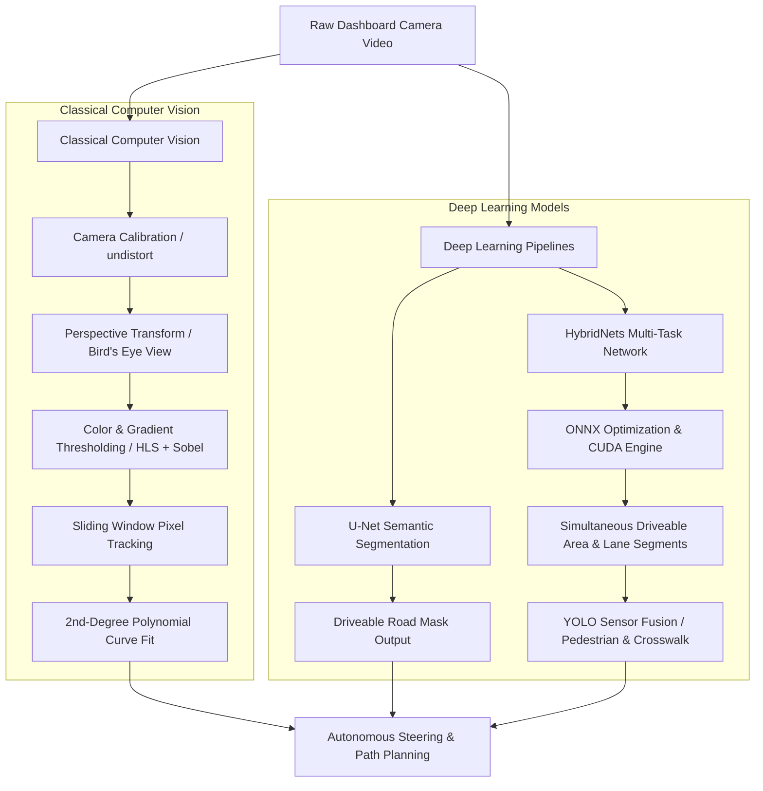

# 🛣️ Advanced Autonomous Road & Lane Line Detection Suite

Welcome to the **Advanced Autonomous Road & Lane Detection Suite**! This repository hosts a comprehensive, state-of-the-art comparative ecosystem evaluating and deploying diverse road/lane line detection algorithms. It bridges the gap between **traditional computer vision** (edge detection, sliding windows, and perspective transforms) and **modern deep learning** (U-Net semantic segmentation and multitasking deep learning models). 

Our research, testing, and stabilization efforts span **six distinct repositories**, culminating in our highly optimized, GPU-accelerated flagship pipeline: **ONNX HybridNets Multitask Road Detection**.

<p align="center">
  
  
  
  
  
</p>

---

## 🎥 Real-Time Multi-Task Showcase

Experience the real-time execution of our flagship **HybridNets Multi-Task** perception pipeline. Below are the actual demo videos showing the unified tracking and multi-panel diagnostic feeds running side-by-side:

<div align="center">
  <table width="100%" style="max-width: 1000px; border-collapse: collapse; border: none;">
    <tr style="border: none;">
      <td width="50%" align="center" style="border: none; padding: 12px; vertical-align: top;">
        <h3>🏙️ City Driving</h3>
        <p><em>Dense Traffic & Lane Shifting</em></p>
        
        <br/><br/>
        <a href="showcase_gifs/Detected15.gif">📁 View Animated GIF</a> | 
        <a href="code/Working/ONNX-HybridNets-Multitask-Road-Detection-main/OutputVideo/New folder (3)/Detected15.mp4">🎥 Play Full Video</a>
      </td>
      <td width="50%" align="center" style="border: none; padding: 12px; vertical-align: top;">
        <h3>🌲 Forest Road</h3>
        <p><em>Curves, Shadows & Lighting Shifts</em></p>
        
        <br/><br/>
        <a href="showcase_gifs/all2.gif">📁 View Animated GIF</a> | 
        <a href="code/Working/ONNX-HybridNets-Multitask-Road-Detection-main/OutputVideo/New folder (2)/all2.mp4">🎥 Play Full Video</a>
      </td>
    </tr>
  </table>
</div>

---

## 🗺️ Architectural Evolution & Pipeline Flow

The following diagram illustrates the evolution of our road and lane line detection methodologies, moving from heuristic-based pixel analysis to unified multi-task deep networks.



---

## 📊 Comprehensive Repository Comparison

We tested, executed, and benchmarked five community repositories alongside our stabilized flagship multi-task model. Here is how they compare across key architectural axes:

| Repository Directory | Algorithmic Method | Curve Handling | Road Segmentation | Object/Zebra Detection | Processing Speed (FPS) | Key Advantages / Features | Primary Limitations |
| :--- | :--- | :--- | :--- | :--- | :--- | :--- | :--- |
| **`RoadLaneLineDetectionMaster(StrightLine)`** | Classical CV (Canny, Hough, Extrapolated Lines) | ❌ Straight Only | ❌ None | ❌ None | 🏎️ High (~60+ FPS) | Extremely lightweight, fast computation, low overhead. | Fails on curves, shadows, or complex boundaries. |
| **`AdvancedLaneDetectionMain`** | Classical CV (HLS + Sobel, Sliding Window, Polyfit) |  Curved Lanes | ❌ None | ❌ None | 🚶 Low (~10-15 FPS) | Curvature radius & offset math, interactive threshold tuning. | Sensitive to shadows, asphalt changes, lane bouncing. |
| **`AdvancedLaneDetectionMaster`** | Classical CV (Sobel X, Grayscale White, HLS, Polyfit) |  Curved Lanes | ❌ None | ❌ None | 🚶 Low (~12-18 FPS) | Window search area optimization using previous-frame history. | High latency, frame-to-frame bouncing in dynamic lighting. |
| **`CarND-Advanced-Lane-Lines-Detection-T1P4-master`** | Classical CV (YCrCb + HLS Channels, Queue Smoother) |  Curved Lanes | ❌ None | ❌ None | 🚶 Low (~8-12 FPS) | Queue-based moving average smoothing, robust color channels. | Large smoothing window causes adjustment lag on sharp turns. |
| **`Road-segmentation-UNET-model-main`** | Deep Learning (U-Net CNN Model) | ❌ None |  Driveable Area | ❌ None | 🏎️ High (~11-13 FPS on CPU, 75+ GPU) | Deep learning robustness, custom annotated South Indian dataset. | Predicts driveable area only; no explicit lane line equations. |
| **🏆 `ONNX-HybridNets-Multitask-Road-Detection-main`** | **End-to-End Multi-Task Deep Learning (HybridNets ONNX)** | ** Curved Lanes** | ** Driveable Area** | ** YOLO Fusion (Pedestrians/Zebra)** | **🏎️ Real-Time (60+ FPS via CUDA)** | **Unified driveable + lane + objects, multi-panel debug visual, IoU metric.** | **Flagship Pipeline: None.** |

---

## 📂 Deep Dive: Repository Summaries

### 1. 🏆 ONNX-HybridNets-Multitask-Road-Detection-main (Flagship Pipeline)
This is our primary stabilized, optimized, and extended repository. It leverages the **HybridNets end-to-end multi-task network** in an ONNX runtime environment, executing three critical autonomous tasks at once.
- **Key Enhancements**:
  - **ONNX Inference Optimization**: Configured `CUDAExecutionProvider` and graph optimization routines, enabling lightning-fast **60+ FPS real-time processing** on GPUs.
  - **4-Quadrant Sensor Fusion Display**: Implemented a dashboard overlay containing (1) Driveable Area, (2) Lane Segmentations, (3) Pedestrian & Crosswalk bounding boxes (fused via auxiliary YOLO models), and (4) The final composite visualization.
  - **Scientific Validation**: Built a complete evaluation pipeline calculating the Intersection over Union (IoU) comparing predictions against ground-truth masks.
  - **Demo Outputs**: Includes extensive diagnostic videos like `Detected15.mp4` and multi-view composites like `all2.mp4` running natively inside this suite.

---

### 2. Road-segmentation-UNET-model-main
A dedicated semantic segmentation project that uses a **U-Net Convolutional Neural Network** to classify pixels as either `road` or `non-road` (driveable area).
- **Core Methodology**:
  - Trained on a custom-collected dataset consisting of **28 hours of dashcam videos** recorded across diverse, complex road conditions in South India (Kerala & Karnataka).
  - Features robust **Data Augmentation (DA)** expanding 100 CVAT-annotated images to **7,000 training images** via random brightness, saturation, contrast, hue, and horizontal flips.
  - Converted from TensorFlow/Keras (`.h5`) to **ONNX** to boost frame processing speed from 300ms (slow) to 80ms (real-time) on low-end hardware.

---

### 3. CarND-Advanced-Lane-Lines-Detection-T1P4-master
An advanced classical computer vision pipeline developed as part of the Udacity Self-Driving Car Nanodegree, featuring complex noise suppression and temporal smoothing.
- **Core Methodology**:
  - Explores multiple colorspaces (RGB, HSV, HLS, Lab, YCrCb), selecting the **Y & Cr channels from YCrCb** and **L & S channels from HLS** for robust lane pixel isolation in shadows.
  - Calculates lane curvature radius and lane center vehicle offset in real-world units (meters).
  - Implements **temporal queue-based smoothing** across consecutive frames to prevent lane boundaries from flickering or bouncing.

---

### 4. AdvancedLaneDetectionMain
A structured implementation of the sliding-window-based lane boundary detection pipeline using OpenCV.
- **Core Features**:
  - Chessboard camera calibration storing distortion matrices in a persistent pickle file (`camera_matrices.p`).
  - Interactive Jupyter notebook widgets allowing developers to tune Sobel gradients and color channel thresholds on-the-fly.
  - Sliding window search (9 windows, width margin 80, min-pixels 45) to fit second-degree polynomial boundaries ($x = Ay^2 + By + C$).

---

### 5. AdvancedLaneDetectionMaster
Another robust implementation of the advanced lane finding classical CV pipeline.
- **Core Features**:
  - Combines Sobel X derivatives, grayscaled white pixel segmentation, and HLS Saturation/Hue masking.
  - Implements **previous-frame history search**: instead of performing a full-image sliding window histogram scan on every frame, it searches restricted search windows centered around the previous frame's polynomial fit, reducing computational latency.

---

### 6. RoadLaneLineDetectionMaster(StrightLine)
A lightweight classical CV project specializing in **straight lane lines** using simple but effective edge and line fitting techniques.
- **Core Features**:
  - Uses Gaussian blur noise reduction, Canny edge detection, and strict polygon Region of Interest (ROI) cropping.
  - Employs Hough Transform line detection and segregates left/right segments based on slope sign, extrapolating them into clean straight lane boundaries.

---

## 🚀 Quick Start Guide

To run or evaluate any of these pipelines, navigate to their respective directories. Below are the basic commands for the main pipelines:

### Running the Flagship HybridNets Pipeline:
```bash
cd code/Working/ONNX-HybridNets-Multitask-Road-Detection-main
# Run standard multi-task video inference with custom displays:
python video_road_detection.py
```

### Running the U-Net Segmentation Pipeline:
```bash
cd code/Working/Road-segmentation-UNET-model-main
# Run Keras or ONNX inference on a video source:
python inference_onnx.py --src path_to_video.mp4 --model models/onnx_models/road_seg_160_160.onnx
```

### Running the Udacity Advanced Lane Finding Pipeline:
```bash
cd code/Working/AdvancedLaneDetectionMain/src
# Execute the python script:
python Advanced_lane_completed2.py
```

---
> [!NOTE]
> For detailed instructions on executing the main stabilized pipeline, configuring the CUDA execution provider, and analyzing model metrics, please consult the dedicated README in:
> [code/Working/ONNX-HybridNets-Multitask-Road-Detection-main/README.md](file:///media/thippe/Download/ubuntu/RunningProjects/LaneLinesDetection/code/Working/ONNX-HybridNets-Multitask-Road-Detection-main/README.md)

---

## 🔗 Original Repositories & Academic Credits

All individual pipelines are developed on top of brilliant open-source research and community implementations. We express our gratitude to the original authors:

1. **`ONNX-HybridNets-Multitask-Road-Detection-main`**
   - **Original Multi-Task PyTorch Model**: [datvuthanh/HybridNets](https://github.com/datvuthanh/HybridNets) (Vu Thanh Dat)
   - **ONNX Implementation & Inference**: [ibaiGorordo/ONNX-HybridNets-Multitask-Road-Detection](https://github.com/ibaiGorordo/ONNX-HybridNets-Multitask-Road-Detection) (Ibai Gorordo)
   - **ONNX Model Zoo Conversion**: [PINTO0309 Model Zoo](https://github.com/PINTO0309/PINTO_model_zoo/tree/main/276_HybridNets) (PINTO0309)
   - **Research Paper**: [HybridNets: End-to-End Multi-Task Self-Driving Network (arXiv:2203.09035)](https://arxiv.org/abs/2203.09035)

2. **`Road-segmentation-UNET-model-main`**
   - **U-Net Segmentation Repository**: [asujaykk/Road-segmentation-UNET-model](https://github.com/asujaykk/Road-segmentation-UNET-model) (Sujay)
   - **Reference Architecture**: [U-Net: Convolutional Networks for Biomedical Image Segmentation](https://arxiv.org/abs/1505.04597) (Ronneberger et al.)

3. **`CarND-Advanced-Lane-Lines-Detection-T1P4-master`**
   - **Queue-Smoothed Advanced Lane Tracking**: [UjjwalSaxena/CarND-Advanced-Lane-Lines-master](https://github.com/UjjwalSaxena/CarND-Advanced-Lane-Lines-master) (Ujjwal Saxena)
   - **Starter Repository Template**: [udacity/CarND-Advanced-Lane-Lines](https://github.com/udacity/CarND-Advanced-Lane-Lines) (Udacity)

4. **`AdvancedLaneDetectionMain`**
   - **Jupyter Threshold-Tuned Pipeline**: Based on [udacity/CarND-Advanced-Lane-Lines](https://github.com/udacity/CarND-Advanced-Lane-Lines)

5. **`AdvancedLaneDetectionMaster`**
   - **Optimized Searching CV Pipeline**: [OanaGaskey/Lane-Lines-Detection](https://github.com/OanaGaskey/Lane-Lines-Detection) (Oana Gaskey)
   - **Starter Repository Template**: [udacity/CarND-Advanced-Lane-Lines](https://github.com/udacity/CarND-Advanced-Lane-Lines)

6. **`RoadLaneLineDetectionMaster(StrightLine)`**
   - **Straight Line Hough CV Detection**: Based on the Udacity Project 1 [udacity/CarND-LaneLines-P1](https://github.com/udacity/CarND-LaneLines-P1)
