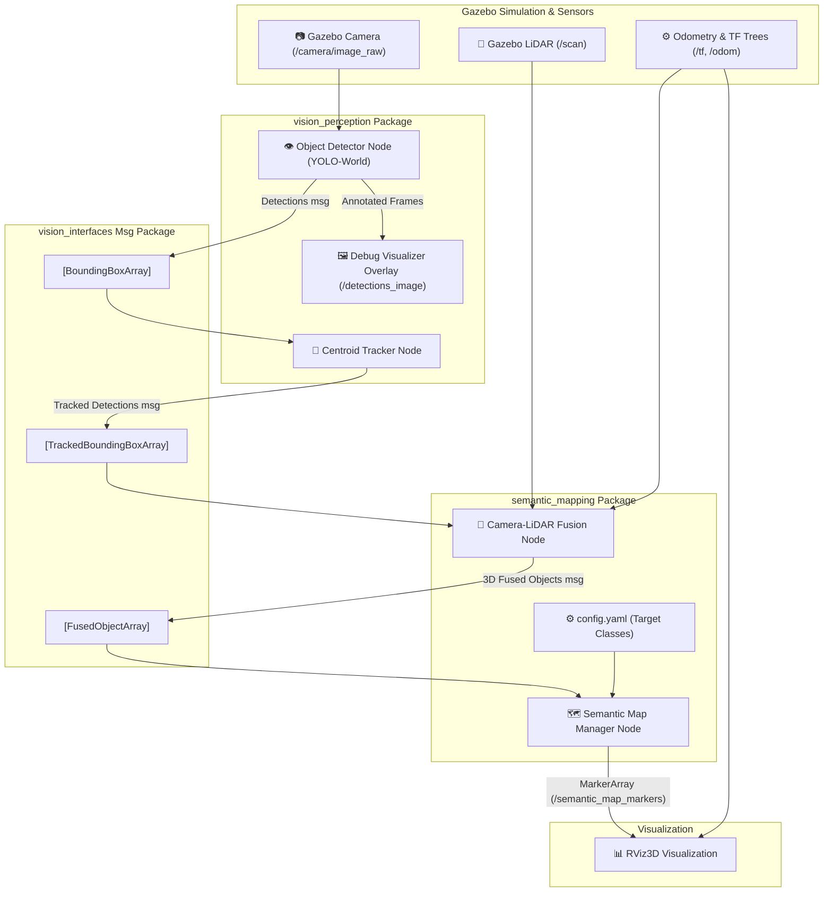

# 🤖 Autonomous Differential Drive Mobile Robot with Vision-Perception & Semantic Mapping

Welcome to the comprehensive **ROS 2 Humble & Gazebo Stack** for autonomous differential drive robots. This repository features physical physics stabilization, optimized mapping sensor refresh rates, and a full real-time visual-perception & 3D semantic mapping suite powered by YOLO/YOLO-World, LiDAR range fusion, and dynamic RViz visualization.

---

## 📐 Overall System Architecture

The following diagram illustrates the real-time sensor processing and data flow of the perception, tracking, sensor fusion, and spatial semantic mapping system:



---

## 📦 Package Directory & Documentation Links

The repository is organized into modular packages, each containing its own specialized documentation. Click on any package link below to explore its respective README:

| Package | Purpose | Documentation Link |
| :--- | :--- | :--- |
| **`my_bot`** | URDF robot description (camera, LIDAR, physics stabilization), Gazebo world models, Nav2/AMCL parameter configuration, and automated start script launchers. | 📖 [my_bot Documentation](my_bot/README.md) |
| **`vision_perception`** | Implements raw camera frame object recognition via YOLO & open-vocabulary YOLO-World along with a spatial nearest-neighbor centroid tracker. | 📖 [vision_perception Documentation](vision_perception/README.md) |
| **`vision_interfaces`** | Custom ROS 2 code bindings / interface definitions (`BoundingBox`, `TrackedBoundingBox`, `FusedObject`) that route data across nodes. | 📖 [vision_interfaces Documentation](vision_interfaces/README.md) |
| **`semantic_mapping`** | Combines 2D image detections and LiDAR laser sweeps to perform camera pinhole inverse depth projection, registers objects in a database, and generates persistent RViz markers. | 📖 [semantic_mapping Documentation](semantic_mapping/README.md) |

---

## ⚡ Quick Start & Deployment Guide

Follow these steps to compile the stack, spawn the stabilized differential drive robot in Gazebo, and run the real-time perception and semantic mapping system.

### 1️⃣ Compile the ROS 2 Workspace
Clean, build, and source the workspaces from the root directory:
```bash
# Source base ROS 2 Humble
source /opt/ros/humble/setup.bash

# Build all packages in the workspace
colcon build --symlink-install

# Source the local installation
source install/setup.bash
```

### 2️⃣ Launch the Gazebo Robot Simulation
Spawn the robot inside a realistic simulated environment (e.g., `warehouse.sdf` or `obstacles.world`) in **Manual Mapping** or **SLAM Navigation** mode:
```bash
# Example: Launch the robot in a synthetic warehouse environment
./main_lunch/start_manual_mapping.sh warehouse.sdf
```
*This starts the Gazebo simulator, loads the optimized physical URDF, runs the differential controllers, publishes the `/scan` and `/camera/image_raw` topics, and starts the SLAM toolbox.*

### 3️⃣ Launch the Perception & Semantic Mapping Pipeline
In a new terminal window, source the workspace and execute the unified launch description. This launcher automatically starts **YOLO-World object detection**, the **centroid tracker**, **sensor fusion**, and the **semantic map manager**:
```bash
# Source the workspace
source install/setup.bash

# Run the complete perception + mapping stack
ros2 launch semantic_mapping semantic_mapping.launch.py
```

### 4️⃣ Visualize Fused Semantic Objects in RViz
1. In your RViz visualizer pane, click **Add** in the bottom left.
2. Select **By topic** and subscribe to:
   - `/semantic_map_markers` (`MarkerArray`)
   - `/detections_image` (`Image` - for the real-time YOLO debug overlay)
3. Set your RViz fixed frame to `map`.
4. As you drive the robot (using teleop keyboard control), you will see deterministic colored **cylinders** representing registered objects, **arrows** showing their detected heading, and floating **labels** updating their observation count dynamically in real time.

---

## 🛠️ Development & custom modifications

- To change the target classes mapped in the 3D database, modify [config.yaml](semantic_mapping/config/config.yaml).
- To configure physical robot parameters, wheel friction, and sensor boundaries (rate / range), edit the URDF files located inside [description/](my_bot/description/).
- To customize the open-vocabulary text labels loaded into YOLO-World, modify the `warehouse_classes` list in [semantic_mapping.launch.py](semantic_mapping/launch/semantic_mapping.launch.py).
